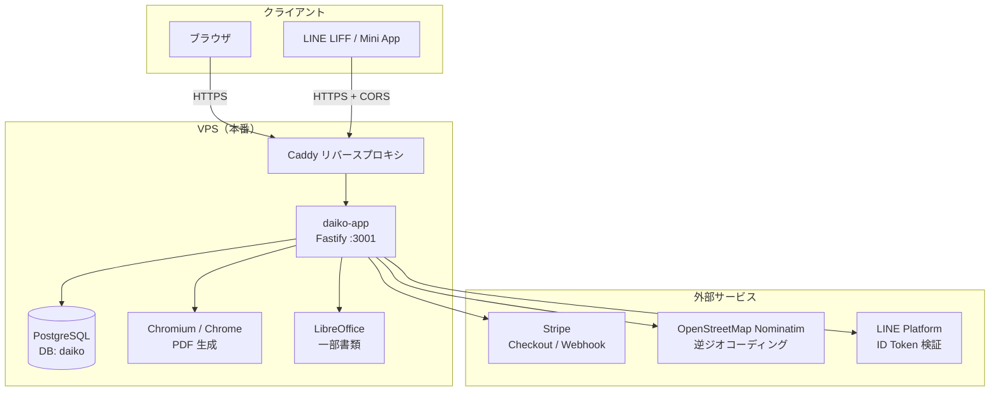
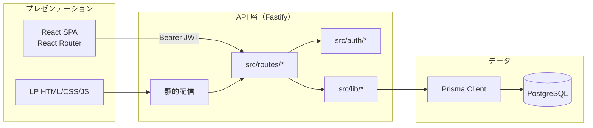
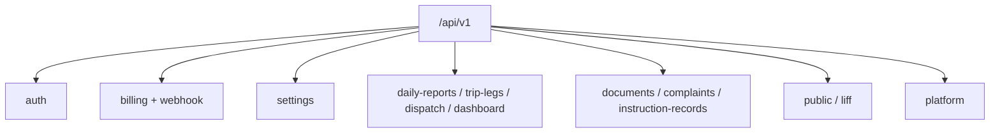
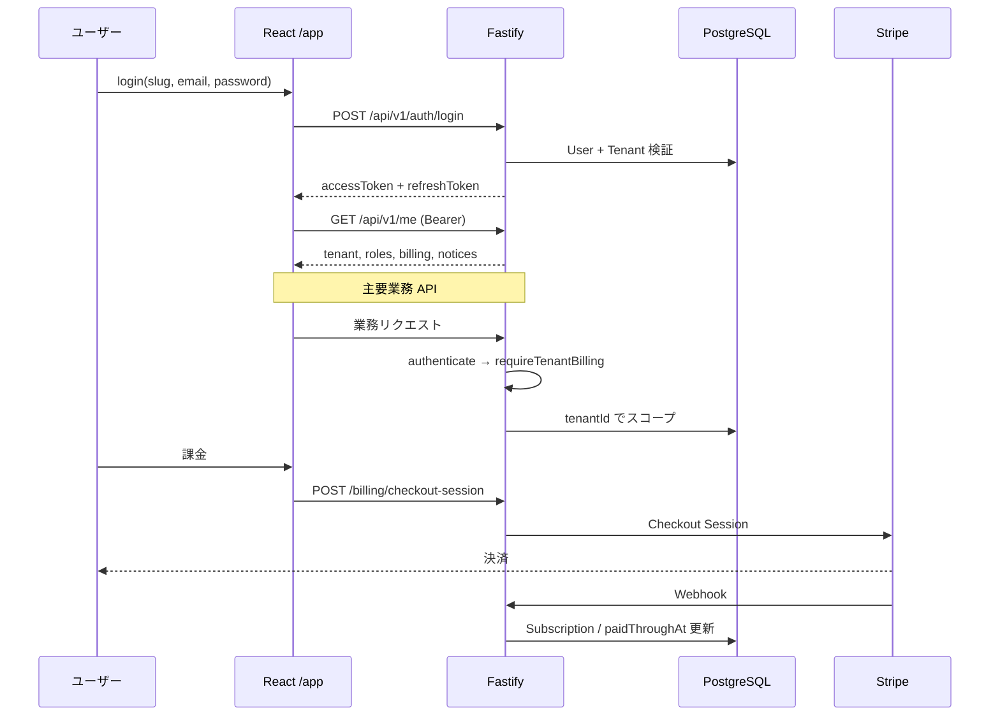
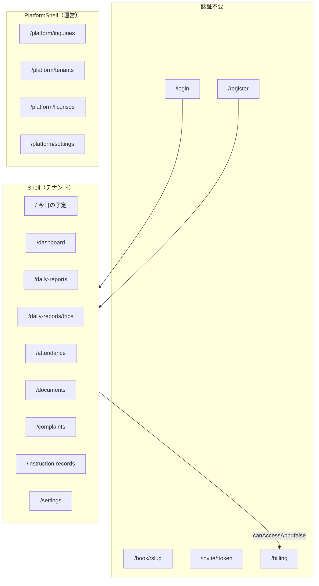
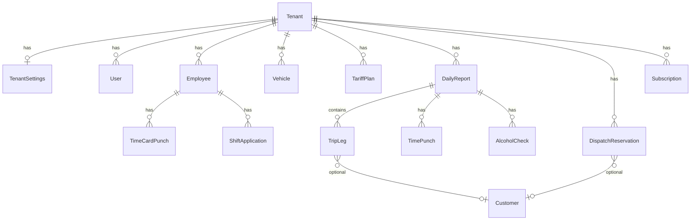
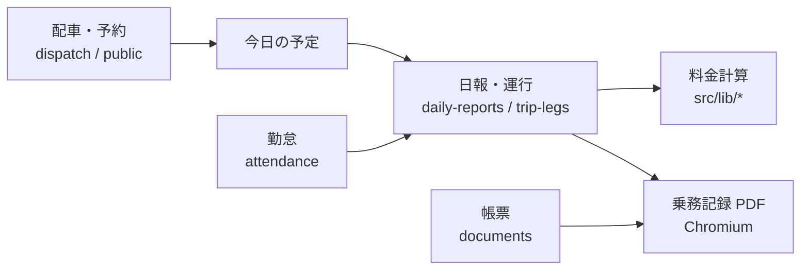
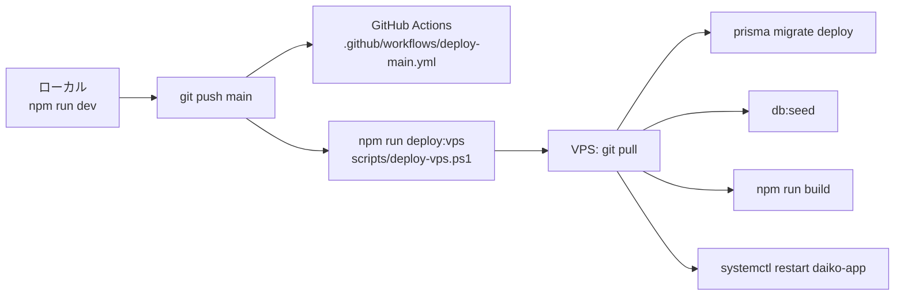

# Daiko システム設計

代行業向けマルチテナント SaaS のアーキテクチャ概要です。実装の入口は [`src/index.ts`](../src/index.ts)、データモデルは [`prisma/schema.prisma`](../prisma/schema.prisma) を参照してください。

関連: [README.md](../README.md)（セットアップ・本番デプロイ）、[AGENTS.md](../AGENTS.md)（エージェント向け運用メモ）

---

## 1. 全体構成（デプロイ・境界）

**Daiko** は **order**（モバイル注文アプリ）とは別リポジトリ・別 PostgreSQL データベースです。本番は `daiko.harunoyukoto.jp`（VPS 上で Caddy → Node `:3001`）を想定しています。



| レイヤ | パス | URL 例 | 役割 |
|--------|------|--------|------|
| LP | `public/lp/` | `/`, `/lp/*`, `/legal/*`, `/report` | マーケティング・問い合わせ導線・機能別ランディング |
| SPA | `web/` → `public/app/` | `/app/*` | テナント業務 UI（React） |
| API | `src/` | `/api/v1/*` | REST API（Fastify） |
| 静的画像 | `public/images/` | `/images/*` | OGP・LP 用画像など |
| DB | `prisma/` | — | スキーマ・マイグレーション |

単一 Node プロセスが LP・SPA・API を配信します（[`src/index.ts`](../src/index.ts)）。

---

## 2. アプリケーション層



**ビルド**

- `npm run build` … `web` を Vite ビルド → `public/app/` に出力 → `tsc` で API をコンパイル
- 開発: ルートで `npm run dev`（API `:3001`）、UI は `cd web && npm run dev`（Vite が `/api` をプロキシ）

---

## 3. API モジュール

プレフィックスは原則 **`/api/v1`**。ルート登録は [`src/index.ts`](../src/index.ts) を参照。

| モジュール | プレフィックス | 主な責務 |
|------------|----------------|----------|
| `auth` | `/api/v1` | テナント登録、ログイン、refresh、`/me`、本人免許 |
| `billing` | `/api/v1/billing` | Stripe Checkout、課金状態 |
| `billing-webhook` | `/api/v1/billing` | Stripe Webhook |
| `settings` | `/api/v1/settings` | 店舗・料金表・車両・従業員・メニュー表示など |
| `attendance` | `/api/v1/attendance` | 勤怠・打刻 |
| `daily-reports` | `/api/v1` | 日報・乗務記録 |
| `trip-legs` | `/api/v1` | 運行一覧・運行明細 |
| `dashboard` | `/api/v1/dashboard` | ダッシュボード集計 |
| `dispatch` | `/api/v1/dispatch` | 配車・予約枠 |
| `documents` | `/api/v1` | 法定帳票・PDF |
| `complaints` | `/api/v1/complaints` | 苦情台帳 |
| `instruction-records` | `/api/v1/instruction-records` | 指導記録 |
| `liff-booking` | `/api/v1/liff` | LINE LIFF 予約 |
| `public-booking` | `/api/v1/public` | ゲスト Web 予約 |
| `employee-invite` | `/api/v1/public` | 従業員招待トークン |
| `public-inquiry` | `/api/v1/public` | LP 問い合わせ |
| `platform` | `/api/v1/platform` | 運営者（全テナント横断） |



OpenAPI: 非本番または `OPENAPI_UI=1` で `/api/v1/docs`、定義 JSON は `/api/v1/openapi.json`。

---

## 4. 認証・マルチテナント・課金



| 概念 | 実装 |
|------|------|
| テナント識別 | JWT の `tenantId`（[`src/auth/pre.ts`](../src/auth/pre.ts)） |
| データ分離 | クエリで `tenantId` を必ず付与 |
| 課金ゲート | [`authenticateAndBilling`](../src/auth/protected-pre.ts)（トライアル・Stripe・ライセンスキー） |
| ロール | `User` ↔ `Role`（owner / staff 等） |

---

## 5. フロントエンド（SPA）

ルート定義: [`web/src/App.tsx`](../web/src/App.tsx)。テナント UI は [`web/src/layout/Shell.tsx`](../web/src/layout/Shell.tsx) でラップ。



メニュー項目はロールと `staff-menu-visibility` 設定でフィルタされます。

---

## 6. ドメインデータ（Prisma）

`Tenant` を中心に、代行店のマスタ・日次運行・コンプライアンス・課金がぶら下がります。全モデルは [`prisma/schema.prisma`](../prisma/schema.prisma) を参照。



| ドメイン塊 | 主なモデル | 用途 |
|------------|------------|------|
| 組織・課金 | `Tenant`, `Subscription`, `LicenseKey`, `StripeWebhookEvent` | SaaS 契約・トライアル |
| マスタ | `Employee`, `Vehicle`, `TariffPlan*`, `Customer`, `ReferralSource` | 店舗設定・料金表 |
| 運行 | `DailyReport`, `TripLeg`, `DispatchReservation`, `AccountsReceivableEntry` | 日次業務・配車・売掛 |
| 勤怠 | `TimePunch`, `TimeCardPunch`, `ShiftApplication`, `ConfirmedShiftDay` | 出退勤・シフト |
| コンプライアンス | `DocumentTemplate`, `ComplaintLedger`, `InstructionRecord`, `GuidanceSession`, `LegalRegisterStub` | 法定・社内帳票 |
| 運営 | `PlatformSetting`, `MarketingInquiry`, `MarketingInquiryReply` | LP 問い合わせ・全テナント管理 |

---

## 7. 主要ビジネスフロー

### 7.1 テナントの一日



### 7.2 外部連携

| 連携 | 用途 | 主なコード |
|------|------|------------|
| Stripe | Checkout・Webhook・課金状態 | `src/routes/billing.ts`, `billing-webhook.ts`, `src/lib/stripe-billing.ts` |
| LINE | LIFF 予約（ID Token） | `src/routes/liff-booking.ts`, `src/lib/line-id-token.ts` |
| Chromium | HTML → PDF（帳票・乗務記録） | `src/lib/html-to-pdf.ts`, `templates/jommu-print/` |
| LibreOffice | 一部ドキュメント変換 | `scripts/ensure-libreoffice-env.sh` |
| Nominatim | 座標 → 地名（キャッシュ付き） | `src/lib/reverse-geocode-cache.ts` |

PDF 未設定時は関連 API が **503** を返します（`CHROMIUM_EXECUTABLE`）。詳細は [README.md](../README.md) の「書類の PDF 出力」を参照。

---

## 8. ディレクトリ構造

```
daiko/
├── web/                 # React + Vite（業務 SPA ソース）
├── src/
│   ├── index.ts         # エントリ・ルート登録・静的配信
│   ├── routes/          # HTTP ハンドラ（ドメイン別）
│   ├── lib/             # 料金・PDF・印刷 HTML・Stripe 等
│   └── auth/            # JWT・課金 preHandler
├── prisma/
│   ├── schema.prisma
│   ├── migrations/
│   └── seed.ts          # 帳票テンプレ等
├── public/
│   ├── lp/              # マーケティング LP
│   ├── app/             # Vite ビルド成果物
│   └── images/
├── templates/           # 乗務記録など印刷用 HTML
├── scripts/             # deploy-vps, Stripe 運用, Chromium/LibreOffice 設定
└── docs/                # 本ドキュメントほか
```

---

## 9. デプロイ



リモート手順の詳細・環境変数は [README.md](../README.md) の「本番（VPS）」を参照。

---

## 10. order との関係

| 項目 | Daiko | order |
|------|-------|-------|
| リポジトリ | 本リポジトリ | 別 clone |
| DB | `daiko` 推奨 | order 用 DB |
| ドメイン例 | `daiko.harunoyukoto.jp` | order 側ホスト |
| 連携 | コード・DB 共有なし（同一 VPS に並置可能） | — |

---

## 更新方針

ルート追加・大きなドメイン変更時は、本ファイルの該当セクション（§3 API、§5 SPA、§6 データ）をあわせて更新してください。
